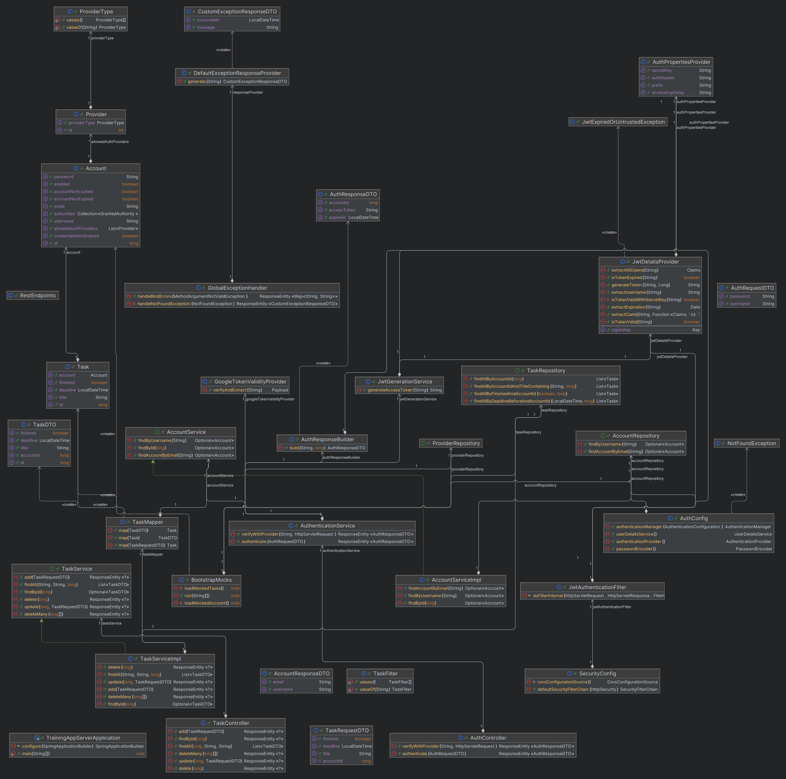

# Aplikacja wdrożeniowa - lista zadań.

### Spis treści:
- [Opis produktu](#opis-produktu)
- [Stack technologiczny](#stack-technologiczny)
- [Konfiguracja środowiska-lokalnego](#konfiguracja-środowiska-lokalnego)
- [Użytkownicy testowi](#użytkownicy-testowi)
- [Schemat UML projektu](#schemat-uml-projektu)

## Opis produktu

Projekt umożliwia predefiniowanym użytkownikom organizację bieżących zadań i
wizualną reprezentację tasków w postaci tabeli danych z funkcjami wyszukiwania
oraz filtrowania.

->  [Spis treści](#spis-treści)

## Stack technologiczny

Do zbudowania aplikacji wykorzystano:

> Backend
- Spring Boot 3.2.5
- Java 21
- Gradle 8.7

> Frontend
- Svelte 4.2.12
- Vite 5.2.0
- TypeScript

-> [Spis treści](#spis-treści)

## Konfiguracja środowiska lokalnego

Aby uruchomić aplikację na serwerze lokalnym, należy:

1. Zainstalować lokalnie bazę danych PostgreSQL, JDK właściwe dla wersji
języka Java, NodeJS oraz Tomcat.
2. Utworzyć bazę danych `btc-training` i skonfigurować systemową zmienną środowiskową
do przechowywania hasła superusera `postgres` według schematu:
> POSTGRES_SUPERUSER_PWD: twoje_hasło_superusera
3. Pobrać zdalne repozytorium projektu za pomocą HTTPS lub SSH.
4. Uruchomić taska `gradle build` (zostanie wygenerowany plik .war w folderze `build/libs`)
5. Skopiować plik .war do folderu `webapps` w katalogach Tomcata i zmienić jego nazwę na ROOT.war.
6. Uruchomić `startup.bat` w katalogu `bin`.

Aplikacja klienta jest dostępna pod adresem `http://localhost:8080/`.

-> [Spis treści](#spis-treści)

## Użytkownicy testowi

Do aplikacji można zalogować się bezpośrednio poprzez:
>użytkownik: user <br />
> hasło: password

oraz

>użytkownik: user2 <br />
> hasło: password

Aplikacja w swoim założeniu nie przewidywała funkcji rejestrowania nowych użytkowników. Chcąc przetestować
uwierzytelnianie przez zewnętrzny provider Google na własnym adresie e-mail, należy
programowalnie stworzyć nowego usera. W tym celu:

1. Otwórz projekt w IDE i nawiguj do `src/main/java/com/btc/backend/core/bootstrap/BootstrapMocks.`
2. Stwórz nowego użytkownika wg. przykładu:
```java
            Account first = new Account();
            first.setUsername("nazwa_użytkownika");
            first.setPassword(passwordEncoder.encode("hasło"));
            first.setEmail("email_istniejącego_konta_google");
```

Jeżeli użytkownik ma mieć możliwość logowania się przez provider Google, dodaj:

```java
            first.setAllowedAuthProviders(providers);
```
w przeciwnym razie:
```java
            first.setAllowedAuthProviders(List.of(providers.getFirst()));
```
Na koniec zapisz użytkownika w bazie danych:
```java
            accountRepository.save(account);
```
3. Wykonaj ponownie kroki od 4 do 6 z  [Konfiguracja środowiska-lokalnego](#konfiguracja-środowiska-lokalnego).

-> [Spis treści](#spis-treści)

## Schemat UML projektu



-> [Spis treści](#spis-treści)


